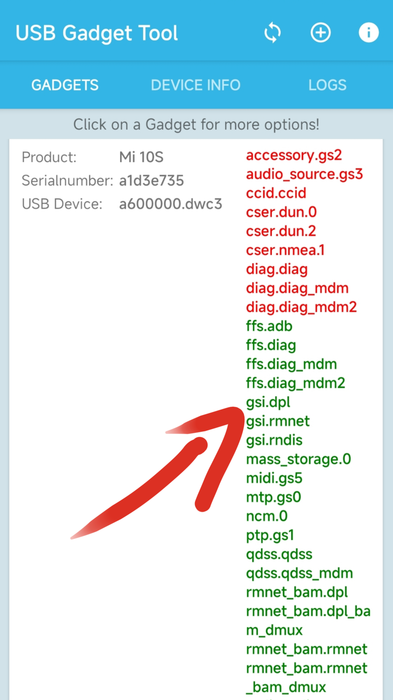
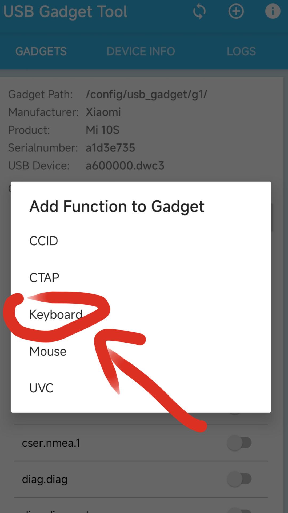
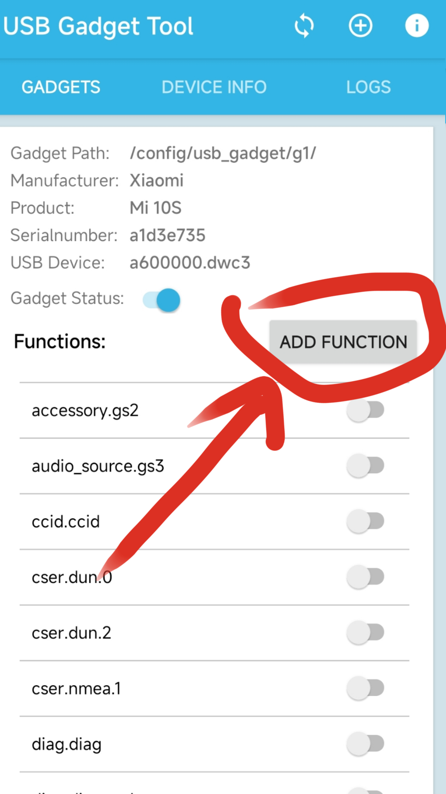

# anusb
#支持用 "#注示掉代码"，支持读取空格和键盘上有的符号，不会读取换行，如需换行请用[ENTER]回车实现，不支持读取中文，但注示里随便你用什么文，因为它不会被执行

#把你写好的脚本文件放到:/data/user/0/com.termux/files/home/.config/anusb/file里，可在配置文件中更改路径
配置文件位置:/data/user/0/com.termux/files/home/.config/anusb/anusb.conf

#安装:
在termux里输入
git clone https://github.com/Ent0248/anusb.git
cd anusb;bash install.sh
还需要安装USB Gadget Tool
前往https://github.com/tejado/android-usb-gadget
下载安装USB Gadget Tool.apk

USB Gadget Tool.apk的设置

#启动: anusb
设置好USB Gadget Tool.apk后需要在anusb里输入hid来选择hid，可能会有多个，需要自己测试，如果没有出现就用数据线连接电脑后尝试重新插拔，只需要设置好一次，直到重启前都不需要再重新设置

#badusb脚本语法:
[SLEEP 1]  #等1秒

[ENTER]  #回车/换行
[SPACE]  #空格
[ESC]  #ESC
[TAB]  #TAB
[CAPS]  #Caps/大小写锁定
[{]  #符号[
[}]  #符号]
[#]  #符号#

#控制键--控制键无法单独使用，必须配合普通按键使用:
[CLEAR]  #松开所有按键
[WIN_1]  #win-按下
[CTRL_1]  #按下坤键
[SHIFT_1]  #Shift-按下
[ALT_1]  #Alt-按下

#CTRL+C示例:
[CTRL_1]C[CLEAR]

#F类
[F1]  #F1
[F2]  #F2
#以此类推到F12......
